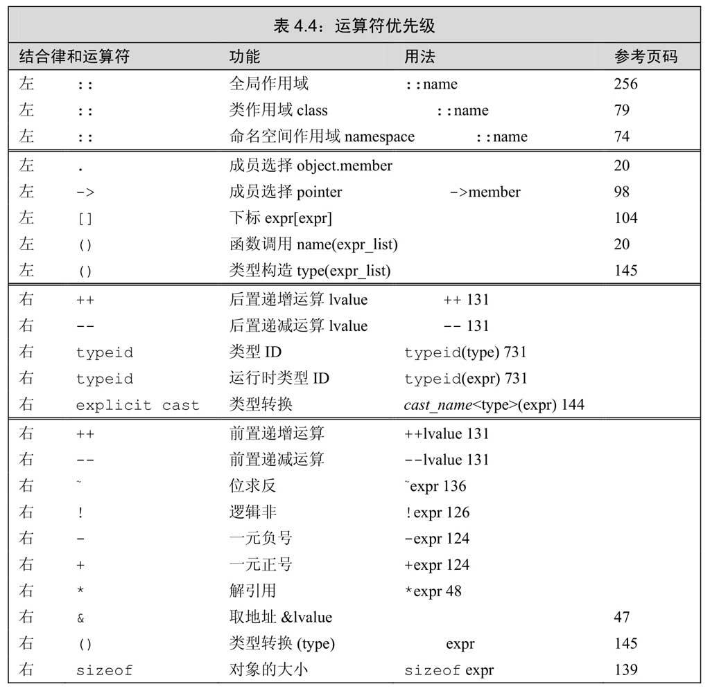
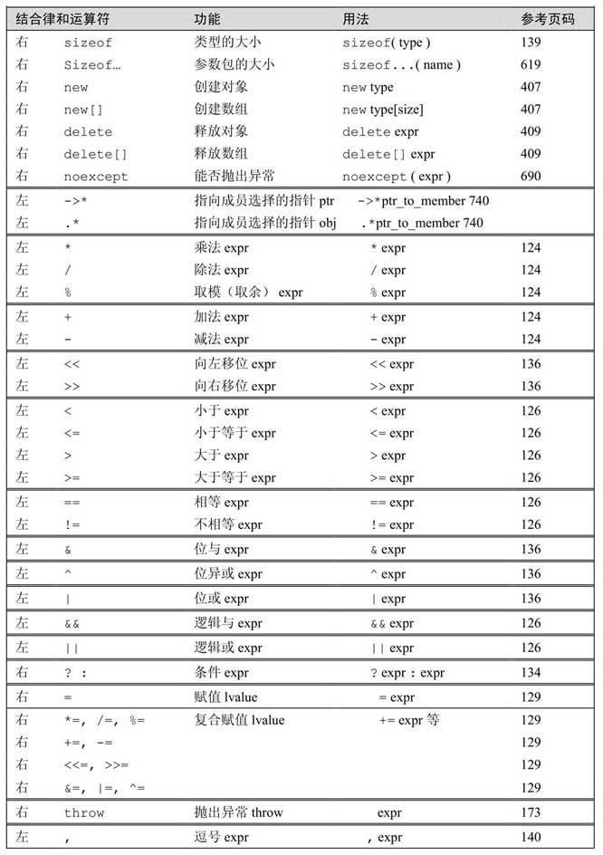

# ch04. 表达式


## 基础

### 基本概念

> 我们使用重载运算符时，其包括运算对象的类型和返回值的类型，都是由该运算符定义的；但是运算对象的个数、运算符的优先级和结合律都是无法改变的。


#### 左值和右值

> C++的表达式要不然是右值（rvalue，读作“are-value”），要不然就是左值（lvalue，读作“ell-value”）。这两个名词是从C语言继承过来的，原本是为了帮助记忆：左值可以位于赋值语句的左侧，右值则不能。
> 
> 在C++语言中，二者的区别就没那么简单了。一个左值表达式的求值结果是一个对象或者一个函数，然而以常量对象为代表的某些左值实际上不能作为赋值语句的左侧运算对象。此外，虽然某些表达式的求值结果是对象，但它们是右值而非左值。可以做一个简单的归纳：当一个对象被用作右值的时候，用的是对象的值（内容）；当对象被用作左值的时候，用的是对象的身份（在内存中的位置）。
> 
> 不同的运算符对运算对象的要求各不相同，有的需要左值运算对象、有的需要右值运算对象；返回值也有差异，有的得到左值结果、有的得到右值结果。一个重要的原则（参见13.6节，第470页将介绍一种例外的情况）是在需要右值的地方可以用左值来代替，但是不能把右值当成左值（也就是位置）使用。当一个左值被当成右值使用时，实际使用的是它的内容（值）。


> 使用关键字decltype（参见2.5.3节，第62页）的时候，左值和右值也有所不同。如果表达式的求值结果是左值，decltype作用于该表达式（不是变量）得到一个引用类型。举个例子，假定p的类型是int＊，因为解引用运算符生成左值，所以decltype（＊p）的结果是int&。另一方面，因为取地址运算符生成右值，所以decltype（&p）的结果是int＊＊，也就是说，结果是一个指向整型指针的指针。


### 优先级与结合律

### 求值顺序

> 对于那些没有指定执行顺序的运算符来说，如果表达式指向并修改了同一个对象，将会引发错误并产生未定义的行为（参见2.1.2节，第33页）。
> 

>
> 有4种运算符明确规定了运算对象的求值顺序。第一种是3.2.3节（第85页）提到的逻辑与（&&）运算符，它规定先求左侧运算对象的值，只有当左侧运算对象的值为真时才继续求右侧运算对象的值。另外三种分别是逻辑或（||）运算符（参见4.3节，第126页）、条件（？：）运算符（参见4.7节，第134页）和逗号（，）运算符（参见4.10节，第140页）。

> 建议：处理复合表达式
> 
> 以下两条经验准则对书写复合表达式有益：  
> 1.拿不准的时候最好用括号来强制让表达式的组合关系符合程序逻辑的要求。  
> 2.如果改变了某个运算对象的值，在表达式的其他地方不要再使用这个运算对象。
> 
> 第2条规则有一个重要例外，当改变运算对象的子表达式本身就是另外一个子表达式的运算对象时该规则无效。例如，在表达式＊++iter中，递增运算符改变iter的值，iter（已经改变）的值又是解引用运算符的运算对象。此时（或类似的情况下），求值的顺序不会成为问题，因为递增运算（即改变运算对象的子表达式）必须先求值，然后才轮到解引用运算。显然，这是一种很常见的用法，不会造成什么问题。


## 算术运算符

> 在除法运算中，如果两个运算对象的符号相同则商为正（如果不为0的话），否则商为负。C++语言的早期版本允许结果为负值的商向上或向下取整，C++11新标准则规定商一律向0取整（即直接切除小数部分）。
> 
> 根据取余运算的定义，如果m和n是整数且n非0，则表达式（m/n）＊n+m%n的求值结果与m相等。隐含的意思是，如果m%n不等于0，则它的符号和m相同。C++语言的早期版本允许m%n的符号匹配n的符号，而且商向负无穷一侧取整，这一方式在新标准中已经被禁止使用了。除了-m导致溢出的特殊情况，其他时候（-m）/n和m/（-n）都等于-（m/n），m%（-n）等于m%n，（-m）%n等于-（m%n）。具体示例如下：
> ```cpp
> 21 % 6;   /* 结果是3  */     21 / 6;    /* 结果是3  */
> 21 % 7;   /* 结果是0  */     21 / 7;    /* 结果是3  */
> -21 % -8; /* 结果是-5 */     -21 / -8;  /* 结果是2  */
> 21 % -5;  /* 结果是1  */     21 / 5;    /* 结果是-4 */
> ```


## 逻辑和关系运算符

> 进行比较运算时除非比较的对象是布尔类型，否则不要使用布尔字面值true和false作为运算对象。


## 赋值运算符

赋值运算符满足右结合律

切勿混淆相等运算符和赋值运算符


## 递增和递减运算符

> 前置版本将对象本身作为左值返回，后置版本则将对象原始值的副本作为右值返回。

> 建议：除非必须，否则不用递增递减运算符的后置版本
> 
> 有C语言背景的读者可能对优先使用前置版本递增运算符有所疑问，其实原因非常简单：前置版本的递增运算符避免了不必要的工作，它把值加1后直接返回改变了的运算对象。与之相比，后置版本需要将原始值存储下来以便于返回这个未修改的内容。如果我们不需要修改前的值，那么后置版本的操作就是一种浪费。
> 
> 对于整数和指针类型来说，编译器可能对这种额外的工作进行一定的优化；但是对于相对复杂的迭代器类型，这种额外的工作就消耗巨大了。建议养成使用前置版本的习惯，这样不仅不需要担心性能的问题，而且更重要的是写出的代码会更符合编程的初衷。

> 后置递增运算符的优先级高于解引用运算符，因此＊pbeg++等价于＊（pbeg++）。pbeg++把pbeg的值加1，然后返回pbeg的初始值的副本作为其求值结果，此时解引用运算符的运算对象是pbeg未增加之前的值。最终，这条语句输出pbeg开始时指向的那个元素，并将指针向前移动一个位置。


## 成员访问运算符

> 解引用运算符的优先级低于点运算符，所以执行解引用运算的子表达式两端必须加上括号。

> 箭头运算符作用于一个指针类型的运算对象，结果是一个左值。点运算符分成两种情况：如果成员所属的对象是左值，那么结果是左值；反之，如果成员所属的对象是右值，那么结果是右值。


## 条件运算符

> 条件运算符的优先级非常低，因此当一条长表达式中嵌套了条件运算子表达式时，通常需要在它两端加上括号。


## 位运算符

#### 移位运算符

> 右侧的运算对象一定不能为负，而且值必须严格小于结果的位数，否则就会产生未定义的行为。

> 移位运算符（又叫IO运算符）满足左结合律


## sizeof运算符

> C++11新标准允许我们使用作用域运算符来获取类成员的大小。通常情况下只有通过类的对象才能访问到类的成员，但是sizeof运算符无须我们提供一个具体的对象，因为要想知道类成员的大小无须真的获取该成员。

> sizeof运算符的结果部分地依赖于其作用的类型：  
> · 对char或者类型为char的表达式执行sizeof运算，结果得1。  
> · 对引用类型执行sizeof运算得到被引用对象所占空间的大小。  
> · 对指针执行sizeof运算得到指针本身所占空间的大小。  
> · 对解引用指针执行sizeof运算得到指针指向的对象所占空间的大小，指针不需有效。  
> · 对数组执行sizeof运算得到整个数组所占空间的大小，等价于对数组中所有的元素各执行一次sizeof运算并将所得结果求和。注意，sizeof运算不会把数组转换成指针来处理。  
> · 对string对象或vector对象执行sizeof运算只返回该类型固定部分的大小，不会计算对象中的元素占用了多少空间。


## 逗号运算符

> 对于逗号运算符来说，首先对左侧的表达式求值，然后将求值结果丢弃掉。逗号运算符真正的结果是右侧表达式的值。如果右侧运算对象是左值，那么最终的求值结果也是左值。


## 类型转换

### 算术转换

> 算术转换的规则定义了一套类型转换的层次，其中运算符的运算对象将转换成最宽的类型。

### 其他隐式类型转换

### 显式转换

#### 命名的强制类型转换

> 一个命名的强制类型转换具有如下形式：
> ```cpp
> cast-name<type>(expression);
> ```
> 其中，type是转换的目标类型而expression是要转换的值。如果type是引用类型，则结果是左值。cast-name是static_cast、dynamic_cast、const_cast和reinterpret_cast中的一种。dynamic_cast支持运行时类型识别，我们将在19.2节（第730页）对其做更详细的介绍。cast-name指定了执行的是哪种转换。

#### static_cast

> 任何具有明确定义的类型转换，只要不包含底层const，都可以使用static_cast。例如，通过将一个运算对象强制转换成double类型就能使表达式执行浮点数除法：
> ```cpp
> // 进行强制类型转换以便执行浮点数除法
> double slope = static_cast<double>(j) / i;
> ```
> 当需要把一个较大的算术类型赋值给较小的类型时，static_cast非常有用。此时，强制类型转换告诉程序的读者和编译器：我们知道并且不在乎潜在的精度损失。一般来说，如果编译器发现一个较大的算术类型试图赋值给较小的类型，就会给出警告信息；但是当我们执行了显式的类型转换后，警告信息就会被关闭了。
> 
> static_cast对于编译器无法自动执行的类型转换也非常有用。例如，我们可以使用static_cast找回存在于void＊指针（参见2.3.2节，第50页）中的值：
> ```cpp
> void * p = &d; // 正确: 任何非常量对象的地址都能存入void*
> // 正确: 将void*转换回初始的指针类型
> double *dp = static_cast<double*>(p);
> ```
> 当我们把指针存放在void＊中，并且使用static_cast将其强制转换回原来的类型时，应该确保指针的值保持不变。也就是说，强制转换的结果将与原始的地址值相等，因此我们必须确保转换后所得的类型就是指针所指的类型。类型一旦不符，将产生未定义的后果。

#### const_cast

> **const_cast只能改变运算对象的底层const**(参见2.4.3节, 第57页): 
> ```cpp
> const char *pc;
> char *p = const_cast<char*>(pc); // 正确: 但是通过p写值是未定义的行为
> ```
> 对于将常量对象转换成非常量对象的行为，我们一般称其为“去掉const性质（cast away the const）”。一旦我们去掉了某个对象的const性质，编译器就不再阻止我们对该对象进行写操作了。如果对象本身不是一个常量，使用强制类型转换获得写权限是合法的行为。然而如果对象是一个常量，再使用const_cast执行写操作就会产生未定义的后果。
> 
> 只有const_cast能改变表达式的常量属性，使用其他形式的命名强制类型转换改变表达式的常量属性都将引发编译器错误。同样的，也不能用const_cast改变表达式的类型：
> ```cpp
> const char *cp;
> // 错误: static_cast不能转换掉const性质
> char *q = static_cast<char*>(cp);
> static_cast<string>(cp); // 正确: 字符串字面值转换成string类型
> const_cast<string>(cp);  // 错误: const_cast只改变常量属性
> ```
> const_cast常常用于有函数重载的上下文中，关于函数重载将在6.4节（第208页）进行详细介绍。


#### reinterpret_cast

> reinterpret_cast通常为运算对象的位模式提供较低层次上的重新解释。举个例子，假设有如下的转换
> ```cpp
> int *ip;
> char *pc = reinterpret_cast<char*>(ip);
> ```
> 我们必须牢记pc所指的真实对象是一个int而非字符，如果把pc当成普通的字符指针使用就可能在运行时发生错误。例如：
> ```cpp
> string str(pc);
> ```
> 可能导致异常的运行时行为。
> 
> 使用reinterpret_cast是非常危险的，用pc初始化str的例子很好地证明了这一点。其中的关键问题是类型改变了，但编译器没有给出任何警告或者错误的提示信息。当我们用一个int的地址初始化pc时，由于显式地声称这种转换合法，所以编译器不会发出任何警告或错误信息。接下来再使用pc时就会认定它的值是char＊类型，编译器没法知道它实际存放的是指向int的指针。最终的结果就是，在上面的例子中虽然用pc初始化str没什么实际意义，甚至还可能引发更糟糕的后果，但仅从语法上而言这种操作无可指摘。查找这类问题的原因非常困难，如果将ip强制转换成pc的语句和用pc初始化string对象的语句分属不同文件就更是如此。

> **reinterpret_cast本质上依赖于机器。要想安全地使用reinterpret_cast必须对涉及的类型和编译器实现转换的过程都非常了解。**


#### 建议：避免强制类型转换

> 强制类型转换干扰了正常的类型检查（参见2.2.2节，第42页），因此我们强烈建议程序员避免使用强制类型转换。这个建议对于reinterpret_cast尤其适用，因为此类类型转换总是充满了风险。在有重载函数的上下文中使用const_cast无可厚非，关于这一点将在6.4节（第208页）中详细介绍；但是在其他情况下使用const_cast也就意味着程序存在某种设计缺陷。其他强制类型转换，比如static_cast和dynamic_cast，都不应该频繁使用。每次书写了一条强制类型转换语句，都应该反复斟酌能否以其他方式实现相同的目标。就算实在无法避免，也应该尽量限制类型转换值的作用域，并且记录对相关类型的所有假定，这样可以减少错误发生的机会。

#### 旧式的强制类型转换

> 在早期版本的C++语言中，显式地进行强制类型转换包含两种形式：
> ```cpp
> type (expr);  // 函数形式的强制类型转换
> (type) expr;  // C语言风格的强制类型转换
> ```


## 运算符优先级表

运算符优先级表



运算符优先级 续表




## 小结


## 术语表

> 算术转换（arithmetic conversion）从一种算术类型转换成另一种算术类型。在二元运算符的上下文中，为了保留精度，算术转换通常把较小的类型转换成较大的类型（例如整型转换成浮点型）。  
> 
> 结合律（associativity）规定具有相同优先级的运算符如何组合在一起。结合律分为左结合律（运算符从左向右组合）和右结合律（运算符从右向左组合）。  
> 
> 二元运算符（binary operator）有两个运算对象参与运算的运算符。
> 
> 强制类型转换（cast）一种显式的类型转换。复合表达式（compound expression）含有多于一个运算符的表达式。
> 
> const_cast 一种涉及const的强制类型转换。将底层const对象转换成对应的非常量类型，或者执行相反的转换。
> 
> 转换（conversion）一种类型的值改变成另一种类型的值的过程。C++语言定义了内置类型的转换规则。类类型同样可以转换。
> 
> dynamic_cast和继承及运行时类型识别一起使用。参见19.2节（第730页）。
>
> 表达式（expression）C++程序中最低级别的计算。表达式将运算符作用于一个或多个运算对象，每个表达式都有对应的求值结果。表达式本身也可以作为运算对象，这时就得到了对多个运算符求值的复合表达式。
> 
> 隐式转换（implicit conversion）由编译器自动执行的类型转换。假如表达式需要某种特定的类型而运算对象是另外一种类型，此时只要规则允许，编译器就会自动地将运算对象转换成所需的类型。
> 
> 整型提升（integral promotion）把一种较小的整数类型转换成与之最接近的较大整数类型的过程。不论是否真的需要，小整数类型（即short、char等）总是会得到提升。
> 
> 左值（lvalue）是指那些求值结果为对象或函数的表达式。一个表示对象的非常量左值可以作为赋值运算符的左侧运算对象。
> 
> 运算对象（operand）表达式在某些值上执行运算，这些值就是运算对象。一个运算符有一个或多个相关的运算对象。
>
> 运算符（operator）决定表达式所做操作的符号。C++语言定义了一套运算符并说明了这些运算符作用于内置类型时的含义。C++还定义了运算符的优先级和结合律以及每种运算符处理的运算对象数量。可以重载运算符使其能处理类类型。
> 
> 求值顺序（order of evaluation）是某个运算符的运算对象的求值顺序。大多数情况下，编译器可以任意选择运算对象求值的顺序。不过运算对象一定要在运算符之前得到求值结果。只有&&、||、条件和逗号四种运算符明确规定了求值顺序。
> 
> 重载运算符（overloaded operator）针对某种运算符重新定义的适用于类类型的版本。第14章将介绍重载运算符的方法。
> 
> 优先级（precedence）规定了复合表达式中不同运算符的执行顺序。与低优先级的运算符相比，高优先级的运算符组合得更紧密。
> 
> 提升（promoted）参见整型提升。
> 
> reinterpret_cast 把运算对象的内容解释成另外一种类型。这种强制类型转换本质上依赖于机器而且非常危险。
> 
> 结果（result） 计算表达式得到的值或对象。
> 
> 右值（rvalue）是指一种表达式，其结果是值而非值所在的位置。
>
> 短路求值（short-circuit evaluation）是一个专有名词，描述逻辑与运算符和逻辑或运算符的执行过程。如果根据运算符的第一个运算对象就能确定整个表达式的结果，求值终止，此时第二个运算对象将不会被求值。
> 
> sizeof 是一个运算符，返回存储对象所需的字节数，该对象的类型可能是某个给定的类型名字，也可能由表达式的返回结果确定。
> 
> static_cast 显式地执行某种定义明确的类型转换，常用于替代由编译器隐式执行的类型转换。
> 
> 一元运算符（unary operators）只有一个运算对象参与运算的运算符。
> 
> ，运算符（，operator）逗号运算符，是一种从左向右求值的二元运算符。逗号运算符的结果是右侧运算对象的值，当且仅当右侧运算对象是左值时逗号运算符的结果是左值。
>
> ？ ：运算符（？： operator）条件运算符，以下述形式提供if-then-else逻辑的表达式cond ? expr1 : expr2;如果条件cond为真，对expr1求值；否则对expr2求值。expr1和expr2的类型应该相同或者能转换成同一种类型。expr1和expr2中只有一个会被求值。
> 
> &&运算符（&&operator）逻辑与运算符，如果两个运算对象都是真，结果才为真。只有当左侧运算对象为真时才会检查右侧运算对象。
> 
> &运算符（&operator）位与运算符，由两个运算对象生成一个新的整型值。如果两个运算对象对应的位都是1，所得结果中该位为1；否则所得结果中该位为0。
> 
> ^运算符（^ operator）位异或运算符，由两个运算对象生成一个新的整型值。如果两个运算对象对应的位有且只有一个是1，所得结果中该位为1；否则所得结果中该位为0。
> 
> ||运算符（|| operator）逻辑或运算符，任何一个运算对象是真，结果就为真。只有当左侧运算对象为假时才会检查右侧运算对象。
> | 运算符（| operator）位或运算符，由两个运算对象生成一个新的整型值。如果两个运算对象对应的位至少有一个是1，所得结果中该位为1；否则所得结果中该位为0。
> 
> ++运算符（++ operator）递增运算符。包括两种形式：前置版本和后置版本。前置递增运算符得到一个左值，它给运算符加1并得到运算对象改变后的值。后置递增运算符得到一个右值，它给运算符加1并得到运算对象原始的、未改变的值的副本。注意：即使迭代器没有定义+运算符，也会有++运算符。
> 
> --运算符（-- operator）递减运算符。包括两种形式：前置版本和后置版本。前置递减运算符得到一个左值，它从运算符减1并得到运算对象改变后的值。后置递减运算符得到一个右值，它从运算符减1并得到运算对象原始的、未改变的值的副本。注意：即使迭代器没有定义-运算符，也会有--运算符。
>
> <<运算符（<< operator）左移运算符，将左侧运算对象的值的（可能是提升后的）副本向左移位，移动的位数由右侧运算对象确定。右侧运算对象必须大于等于0而且小于结果的位数。左侧运算对象应该是无符号类型，如果它是带符号类型，则一旦移动改变了符号位的值就会产生未定义的结果。
> 
> >>运算符（>>operator）右移运算符，除了移动方向相反，其他性质都和左移运算符类似。如果左侧运算对象是带符号类型，那么根据实现的不同新移入的内容也不同，新移入的位可能都是0，也可能都是符号位的副本。
> 
> ～运算符（～ operator）位求反运算符，生成一个新的整型值。该值的每一位恰好与（可能是提升后的）运算对象的对应位相反。
> 
> ！运算符（！ operator）逻辑非运算符，将它的运算对象的布尔值取反。如果运算对象是假，则结果为真，如果运算对象是真，则结果为假。
>
> 


