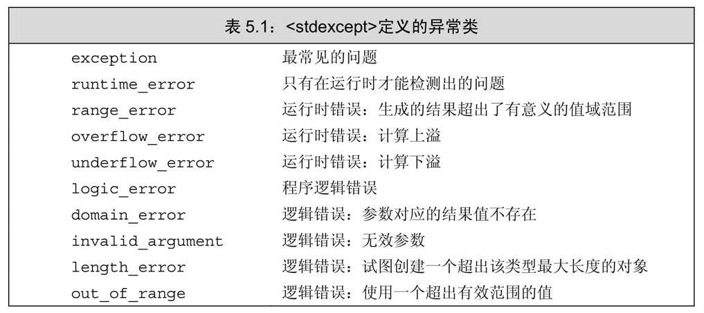

# ch05. 语句


## 简单语句

> 表达式语句的作用是执行表达式并丢弃掉求值结果

> **使用空语句时应该加上注释，从而令读这段代码的人知道该语句是有意省略的。**

空块的作用等价于空语句. 


## 语句作用域


## 条件语句

### if语句

注意使用花括号

> 就C++而言，它规定else与离它最近的尚未匹配的if匹配，从而消除了程序的二义性。

### switch语句

> case关键字和它对应的值一起被称为case标签（case label）。case标签必须是整型常量表达式（参见2.4.4节，第58页）
> 
> 任何两个case标签的值不能相同，否则就会引发错误。另外，default也是一种特殊的case标签，关于它的知识将在第162页介绍。


> 一般不要省略case分支最后的break语句。如果没写break语句，最好加一段注释说清楚程序的逻辑。

> 尽管switch语句不是非得在最后一个标签后面写上break，但是为了安全起见，最好这么做。因为这样的话，即使以后再增加新的case分支，也不用再在前面补充break语句了。

> 即使不准备在default标签下做任何工作，定义一个default标签也是有用的。其目的在于告诉程序的读者，我们已经考虑到了默认的情况，只是目前什么也没做。


注意switch内部的变量定义, 最好用上大括号包装成复合语句块. 


## 迭代语句

### while语句

> 定义在while条件部分或者while循环体内的变量每次迭代都经历从创建到销毁的过程。

### 传统的for语句

> 牢记for语句头中定义的对象只在for循环体内可见。

> 和其他的声明一样，init-statement也可以定义多个对象。但是init-statement只能有一条声明语句，因此，所有变量的基础类型必须相同（参见2.3节，第45页）。

### 范围for语句

### do while语句

> do while语句应该在括号包围起来的条件后面用一个分号表示语句结束。


## 跳转语句

### break语句

### continue语句

### goto语句

> 不要在程序中使用goto语句，因为它使得程序既难理解又难修改。


## try语句块和异常处理

### throw表达式

> 程序的异常检测部分使用throw表达式引发一个异常。throw表达式包含关键字throw和紧随其后的一个表达式，其中表达式的类型就是抛出的异常类型。throw表达式后面通常紧跟一个分号，从而构成一条表达式语句。

> 类型runtime_error是标准库异常类型的一种，定义在stdexcept头文件中。关于标准库异常类型更多的知识将在5.6.3节（第176页）介绍。我们必须初始化runtime_error的对象，方式是给它提供一个string对象或者一个C风格的字符串（参见3.5.4节，第109页），这个字符串中有一些关于异常的辅助信息。

### try语句块

> try语句块的通用语法形式是
> ```cpp
> try {
>     program-statements
> } catch (exception-declaration) {
>     handler-statements
> } catch (exception-declaration) {
>     handler-statements
> } // ...
> ```
> try语句块的一开始是关键字try，随后紧跟着一个块，这个块就像大多数时候那样是花括号括起来的语句序列。
> 
> 跟在try块之后的是一个或多个catch子句。catch子句包括三部分：关键字catch、括号内一个（可能未命名的）对象的声明（称作异常声明，exception declaration）以及一个块。当选中了某个catch子句处理异常之后，执行与之对应的块。catch一旦完成，程序跳转到try语句块最后一个catch子句之后的那条语句继续执行。
> 
> try语句块中的program-statements组成程序的正常逻辑，像其他任何块一样，program-statements可以有包括声明在内的任意C++语句。一如往常，try语句块内声明的变量在块外部无法访问，特别是在catch子句内也无法访问。

#### 函数在寻找处理代码的过程中退出

> 沿着程序的执行路径逐层回退，直到找到适当类型的catch子句为止。
> 
> 如果最终还是没能找到任何匹配的catch子句，程序转到名为terminate的标准库函数。该函数的行为与系统有关，一般情况下，执行该函数将导致程序非正常退出。
> 
> 对于那些没有任何try语句块定义的异常，也按照类似的方式处理：毕竟，没有try语句块也就意味着没有匹配的catch子句。如果一段程序没有try语句块且发生了异常，系统会调用terminate函数并终止当前程序的执行。

> **提示：编写异常安全的代码非常困难**

### 标准异常

> C++标准库定义了一组类，用于报告标准库函数遇到的问题。这些异常类也可以在用户编写的程序中使用，它们分别定义在4个头文件中：  
> · exception头文件定义了最通用的异常类exception。它只报告异常的发生，不提供任何额外信息。  
> · stdexcept头文件定义了几种常用的异常类，详细信息在表5.1中列出。  
> · new头文件定义了bad_alloc异常类型，这种类型将在12.1.2节（第407页）详细介绍。  
> · type_info头文件定义了bad_cast异常类型，这种类型将在19.2节（第731页）详细介绍。
> 
> 标准库异常类只定义了几种运算，包括创建或拷贝异常类型的对象，以及为异常类型的对象赋值。
> 
> 我们只能以默认初始化（参见2.2.1节，第40页）的方式初始化exception、bad_alloc和bad_cast对象，不允许为这些对象提供初始值。
> 
> 其他异常类型的行为则恰好相反：应该使用string对象或者C风格字符串初始化这些类型的对象，但是不允许使用默认初始化的方式。当创建此类对象时，必须提供初始值，该初始值含有错误相关的信息。
> 
> 异常类型只定义了一个名为what的成员函数，该函数没有任何参数，返回值是一个指向C风格字符串（参见3.5.4节，第109页）的const char＊。该字符串的目的是提供关于异常的一些文本信息。
> 
> what函数返回的C风格字符串的内容与异常对象的类型有关。如果异常类型有一个字符串初始值，则what返回该字符串。对于其他无初始值的异常类型来说，what返回的内容由编译器决定。


## 小结


## 术语表


>
> 块（block）包围在花括号内的由0条或多条语句组成的序列。块也是一条语句，所以只要是能使用语句的地方，就可以使用块。
> 
> break语句（break statement）终止离它最近的循环或switch语句。控制权转移到循环或switch之后的第一条语句。
> 
> case标签（case label）在switch语句中紧跟在case关键字之后的常量表达式（参见2.4.4节，第58页）。在同一个switch语句中任意两个case标签的值不能相同。
> 
> catch子句（catch clause）由三部分组成：catch关键字、括号里的异常声明以及一个语句块。catch子句的代码负责处理在异常声明中定义的异常。
> 
> 复合语句（compound statement）和块是同义词。
> 
> continue语句（continue statement）终止离它最近的循环的当前迭代。控制权转移到while或do while语句的条件部分、或者范围for循环的下一次迭代、或者传统for循环头部的表达式。
>
> 悬垂else（dangling else）是一个俗语，指的是如何处理嵌套if语句中if分支多于else分支的情况。C++语言规定，else应该与前一个未匹配的if匹配在一起。使用花括号可以把位于内层的if语句隐藏起来，这样程序员就能更好地控制else该与哪个if匹配。
> 
> default标签（default label）是一种特殊的case标签，当switch表达式的值与所有case标签都无法匹配时，程序执行default标签下的内容。
> 
> do while语句（do while statement）与while语句类似，区别是do while语句先执行循环体，再判断条件。循环体代码至少会执行一次。
> 
> 异常类（exception class）是标准库定义的一组类，用于表示程序发生的错误。表5.1（第176页）列出了不同用途的异常类。
> 
> 异常声明（exception declaration）位于catch子句中的声明，指定了该catch子句能处理的异常类型。
> 
> 异常处理代码（exception handler）程序某处引发异常后，用于处理该异常的另一处代码。和catch子句是同义词。
>
> 异常安全（exception safe）是一个术语，表示的含义是当抛出异常后，程序能执行正确的行为。
> 
> 表达式语句（expression statement）即一条表达式后面跟上一个分号，令表达式执行求值过程。
> 
> 控制流（flow of control）程序的执行路径。
> 
> for语句（for statement）提供迭代执行的迭代语句。常常用于遍历一个容器或者重复计算若干次。
> 
> goto语句（goto statement）令控制权无条件转移到同一函数中一个指定的带标签语句。goto语句容易造成程序的控制流混乱，应禁止使用。
> 
> if else语句（if else statement）判断条件，根据其结果分别执行if分支或else分支的语句。
> 
> if语句（if statement）判断条件，根据其结果有选择地执行语句。如果条件为真，执行if分支的代码；如果条件为假，控制权转移到if结构之后的第一条语句。
> 
> 带标签语句（labeled statement）前面带有标签的语句。所谓标签是指一个标识符以及紧跟着的一个冒号。对于同一个标识符来说，用作标签的同时还能用于其他目的，互不干扰。
>
> 空语句（null statement）只含有一个分号的语句。
> 
> 引发（raise）含义类似于throw。在C++语言中既可以说抛出异常，也可以说引发异常。
> 
> 范围for语句（range for statement）在一个序列中进行迭代的语句。
> 
> switch语句（switch statement）一种条件语句，首先求switch关键字后面表达式的值，如果某个case标签的值与表达式的值相等，程序直接跨过之前的代码从这个case标签开始执行。当所有case标签都无法匹配时，如果有default标签，从default标签继续执行；如果没有，结束switch语句。
> 
> terminate 是一个标准库函数，当异常没有被捕捉到时调用。terminate终止当前程序的执行。
> 
> throw表达式（throw expression）一种中断当前执行路径的表达式。throw表达式抛出一个异常并把控制权转移到能处理该异常的最近的catch子句。
>
> try语句块（try block）跟在try关键字后面的块，以及一个或多个catch子句。如果try语句块的代码引发异常并且其中一个catch子句匹配该异常类型，则异常被该catch子句处理。否则，异常将由外围try语句块处理，或者程序终止。
> 
> while语句（while statement）只要指定的条件为真，就一直迭代执行目标语句。随着条件真值的不同，循环可能执行多次，也可能一次也不执行。
> 


